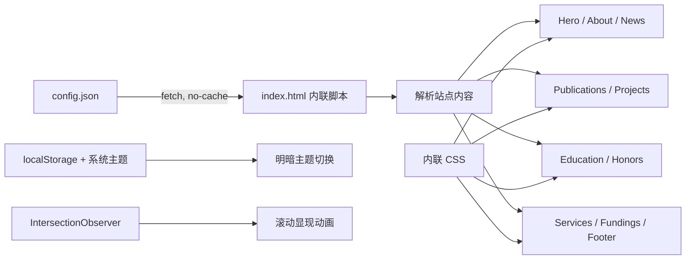

# 项目上下文与维护记忆

> 这是供维护者和后续 Agent 快速恢复上下文的项目级记忆。事实来自当前仓库、Git 历史和线上部署检查；最后核对日期：2026-08-24。

## 一句话概览

这是 Minyan Zhan（詹敏言）的纯静态学术个人主页，通过 GitHub Pages 发布。页面内容集中维护在 `config.json`，布局、样式、渲染和交互集中在 `index.html`，没有构建步骤、包管理器或后端。

## 当前状态

| 项目 | 当前值 |
|---|---|
| 仓库 | `YAN-17-future/YAN-17-future.github.io` |
| 主分支 | `main` |
| 线上地址 | <https://yan-17-future.github.io/> |
| 发布方式 | GitHub Pages，仓库名即用户主页域名 |
| 技术形态 | 原生 HTML、内联 CSS、原生 JavaScript、JSON |
| 内容主题 | 本科生学术主页，图像处理与计算机视觉 |
| 视觉方向 | 冷调蓝白、轻玻璃感、柔和渐变，保持学术主页的清爽和可信度 |
| 当前项目 | 全自主物流搬运小车、二维太阳能追踪系统 |
| 最近一次功能提交 | `dd4a7a1`：调整 Publications 与 Projects 样式 |

2026-08-24 检查时，线上首页和线上 `config.json` 均返回 HTTP 200，内容长度与本地文件一致。

## 文件地图

| 路径 | 职责 | 修改时机 |
|---|---|---|
| `index.html` | 页面结构、完整 CSS、所有渲染逻辑和交互 | 修改布局、视觉或行为时 |
| `config.json` | 姓名、简介、链接、动态列表等站点内容 | 日常更新个人资料和成果时 |
| `images/profile.jpg` | 首页 4:3 真实个人环境照 | 更换首页个人形象时 |
| `images/project-logistics-cart.png` | Fully Autonomous Logistics Handling Cart 项目简介附图 | 更换物流小车项目展示图时 |
| `images/project-solar-tracker.png` | 2D Solar Tracking System 项目简介附图 | 更换太阳能追踪项目展示图时 |
| `images/about1.jpg` 至 `about5.jpg` | 5 张 800×600 网图占位素材 | 不用作个人照；可在确认无用后清理 |
| `images/avatar1.jpg` 至 `avatar3.jpg` | 3 张 800×800 网图占位素材 | 不用作个人头像；可在确认无用后清理 |

仓库目前没有 README、自动化测试、构建配置或依赖清单。

## 架构与数据流



浏览器加载 `index.html` 后，异步请求同目录下的 `config.json`。配置读取失败时页面不会中断，而是保留默认占位内容或空状态。渲染过程直接创建 DOM，部分富文本使用 `innerHTML`。

## `config.json` 内容模型

| 字段 | 用途 |
|---|---|
| `name.en`, `name.cn` | 英文名和中文名 |
| `title`, `school`, `research_interests` | Hero 区身份信息 |
| `about`, `email`, `avatar` | 简介、联系邮箱和头像路径 |
| `social_links` | Scholar、GitHub、ORCID、DBLP、Twitter |
| `news[]` | 日期与新闻内容 |
| `publications[]` | 论文标题、作者、会议信息、图片、描述及外链 |
| `projects[]` | 项目名、简介附图、摘要、描述、标签、GitHub 与演示链接 |
| `education[]` | 时间、学位、学校和补充信息 |
| `honors[]` | 荣誉奖项卡片；支持 `date`、`level`、`title`、`meta`，也兼容旧字符串 |
| `services.reviewer`, `services.member` | 审稿与会员经历 |
| `fundings[]` | 项目来源、周期和编号 |

新增普通内容优先只改 `config.json`。只有现有字段无法表达需求时，才同时修改 HTML 渲染逻辑和样式。

## 已实现行为

- 响应式桌面导航和全屏移动菜单。
- 平滑锚点滚动，并为固定页头保留 80px 偏移。
- 明暗主题自动跟随系统，也可手动切换并保存到 `localStorage`。
- Sticky Header 在页面滚动后改变样式。
- About、列表区域使用 `IntersectionObserver` 实现一次性显现动画。
- Publications 和 Projects 使用可展开卡片。
- Honors & Awards 使用结构化双列奖项卡片，窄屏自动变为单列。
- 社交链接仅在对应配置值非空时创建。
- 图片加载失败时显示占位内容。

外部显示依赖包括 Google Fonts、Font Awesome CDN 和 Academicons CDN；这些服务不可用时，正文仍可显示，但字体或图标会退化。

## 本地运行与发布

不要直接双击 `index.html` 验证内容，因为 `fetch('config.json')` 在 `file://` 下可能被浏览器阻止。应在仓库根目录启动静态服务器：

```powershell
python -m http.server 8000
```

然后访问 <http://localhost:8000/>。发布没有构建产物：验证完成后提交并推送 `main`，GitHub Pages 会直接托管仓库中的静态文件。

### GitHub 推送备忘

常规推送先用：

```powershell
git push origin main
```

这台机器上 HTTPS 到 GitHub 偶尔会出现 `Recv failure: Connection was reset`、`Could not connect to server` 或 DNS 短暂失败。遇到这种情况，不要 force push，也不要重新提交；先确认本地只领先远端预期提交：

```powershell
git status --short --branch
git log --oneline -3
```

已验证可用的备用推送通道是 GitHub SSH 443，并显式指定 Windows OpenSSH：

```powershell
git -c core.sshCommand="C:/Windows/System32/OpenSSH/ssh.exe -p 443" push --progress ssh://git@ssh.github.com:443/YAN-17-future/YAN-17-future.github.io.git main
```

推送后用同一 SSH 通道核对远端 `main`：

```powershell
git rev-parse HEAD
git -c core.sshCommand="C:/Windows/System32/OpenSSH/ssh.exe -p 443" ls-remote ssh://git@ssh.github.com:443/YAN-17-future/YAN-17-future.github.io.git refs/heads/main
```

如果两个 SHA 一致，但 `git status` 因为临时 SSH URL 推送仍显示 `ahead 1`，只同步本地追踪引用：

```powershell
git update-ref refs/remotes/origin/main <远端 main 的 SHA>
git status --short --branch
```

## 修改后的最小验证

1. 确认 `config.json` 仍是合法 UTF-8 JSON。
2. 通过本地 HTTP 服务器打开页面，而不是使用 `file://`。
3. 检查桌面和窄屏布局、移动菜单、锚点滚动及明暗主题。
4. 展开每个 Publication/Project 卡片并验证外链。
5. 在浏览器控制台确认没有配置加载、DOM 或图片错误。
6. 推送后检查线上首页与 `config.json` 均返回 HTTP 200。

## 已知问题与风险

- `config.avatar` 已引用 `images/profile.jpg`；`about-image` 仍没有渲染逻辑，原有 8 张网图占位素材均未被页面引用。
- Scholar 地址为空，但 “View all on Google Scholar” 仍会显示为无效的 `#` 链接。
- Publications、Services 和 Fundings 当前为空，但对应区块仍显示空状态；页面会显得比实际内容更长。
- 桌面导航没有 Services 和 Fundings，移动导航却包含它们，两端导航不一致。
- 多个配置字段通过 `innerHTML` 写入页面。当前配置是仓库内受信任数据；若未来改为外部数据源，必须先做 HTML 转义或清洗。
- 所有 CSS 和 JavaScript 都在单个 `index.html` 中。当前规模尚可维护，但继续加入复杂功能会增加回归风险。
- 页脚年份固定为 2026，需要手动更新或改为运行时年份。

## 近期演进记录

| 日期 | 提交 | 变化 |
|---|---|---|
| 2026-06-16 | `53b6218` | 创建混合风格学术主页 |
| 2026-06-16 | `d573629` | 个性化内容，用 Projects 替代 Teaching |
| 2026-06-16 | `33a27ed` | Publications 与 Projects 改为可展开卡片 |
| 2026-06-16 | `22ac068` | 加入物流小车和二维太阳能追踪项目 |
| 2026-06-16 | `dd4a7a1` | 再次调整 Publications 与 Projects 布局 |

## 推荐维护顺序

1. 首页已接入真实个人照；只在有真实学习或项目场景照时再启用 About 图片。
2. 隐藏没有内容的区块和空 Scholar 链接，或补充真实内容。
3. 统一桌面与移动导航。
4. 将固定年份改为 `new Date().getFullYear()`。
5. 页面逻辑继续增长时，再拆分 `styles.css`、`app.js`；当前不必为拆分而拆分。

## Graphify 记录

2026-08-24 执行了仓库级 Graphify 初始化。该工具把项目识别为 1 个代码文件、1 个文档类文件和 8 张图片，但静态单页与 JSON 没有产生 AST 节点，完整性保护因此拒绝写出空的 `graph.json`。本文件随后只依据失败输出指出的入口 `index.html`、`config.json`、Git 元数据及线上部署响应编写，没有虚构图关系。

如果后续把 JavaScript 拆成可解析模块，或为 Graphify 配置语义提取后端，可重新执行：

```powershell
powershell -NoProfile -ExecutionPolicy Bypass -File C:\Users\z\.graphify\codex-onboard.ps1 -Path . -Refresh
```

## 维护规则

- 架构、部署方式、配置字段或关键决策变化时，同步更新本文。
- 只记录已从代码、配置、提交历史或实际验证确认的事实。
- 临时调试过程不进入长期记忆；可复用的失败原因和验证方法才保留。
- 不在本文保存令牌、密钥、Cookie 或其他凭据。
